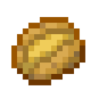

<div align="center">
 
 
```
 ______                      __   __                                   
/\__  _\                    /\ \ /\ \                                  
\/_/\ \/      ___      __   \ `\`\/'/'      __        __        __     
   \ \ \     /'___\  /'__`\  `\/ > <      /'__`\    /'_ `\    /'__`\   
    \_\ \__ /\ \__/ /\  __/     \/'/\`\  /\ \L\.\_ /\ \L\ \  /\ \L\.\_ 
    /\_____\\ \____\\ \____\    /\_\\ \_\\ \__/.\_\\ \____ \ \ \__/.\_\
    \/_____/ \/____/ \/____/    \/_/ \/_/ \/__/\/_/ \/___L\ \ \/__/\/_/
                                                      /\____/          
                                                      \_/__/           
```
</div>

### **Community**


### **Skills**


### **Work Station**
[](https://microsoft.com)


### **Markup Languages**


### **Tools**

[](https://www.figma.com)
[](https://)
[](https://https://obsproject.com/)
[](https://obsidian.md)
[](https://www.aseprite.org)


